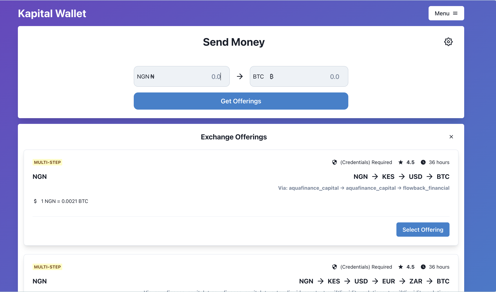

# Kapital – A Cross-Border Digital Wallet

**Kapital** is a decentralized wallet application that leverages the tbDEX protocol to facilitate fast and compliant cross-border transactions between wallet users and financial institutions (PFIs). Kapital is designed for simplicity, security, and profitability, empowering users to seamlessly exchange assets across borders while managing their decentralized identifiers and verifiable credentials.

## Vision:

Kapital will be a secure digital wallet that empowers users to transfer funds across borders beyond the limitations of traditional financial solutions. By integrating with the tbDEX decentralized identity (DID) system and connecting users to a network of liquidity providers, Kapital will provide a massive network of routing options for payment settlement while ensuring faster processing, reduced transaction costs, and a smooth user experience.

In the future, Kapital will offer additional financial services such as microloans, pension management, and DeFi pools, using collateralized digital assets. This decentralized approach will not only address currency exchange bottlenecks but also open up users to larger markets across neighboring countries, where cross-border transactions have historically been hindered by complex and limited currency exchange channels. Kapital's vision is to enhance continental financial inclusion and offer innovative solutions that remove barriers in the African trading landscape.

## Project Overview

### Description

Cross-border transactions are often difficult due to complex regulations and limited access. **Kapital** simplifies this by connecting users to liquidity providers via the tbDEX protocol for instant, compliant transfers across Africa.

With Decentralized Identifiers (DIDs) and Verifiable Credentials, users enjoy a seamless experience without repeatedly verifying credentials. Kapital also opens up broader market access for currency exchanges and trade, empowering businesses and individuals to easily transact across borders.

In addition, Kapital introduces tokenized collateral assets and offers services like pension systems, insurance, and risk trading, enhancing financial inclusion and opportunities across the continent.

### Key Features

- **Cross-Border Transactions**: Kapital allows users to convert and transfer funds between multiple currencies (e.g., NGN to KES, USD to EUR) using liquidity providers (PFIs) within the tbDEX network. The wallet will offer:

  - Automatic or manual matching of PFIs based on user preferences (rate, speed, fees).
  - Users can see available exchange routes and rates.
  - Transaction flow will simulate a seamless transfer, leveraging the sandboxed liquidity.

- **Secure Identity Verification**: Each user will have a decentralized identity (DID), which tbBridge will manage securely. The DID will allow users to:

  - Authenticate themselves across PFIs.
  - Store verifiable credentials, required by PFIs for compliance.
  - Fetch verifiable credentials (e.g., ID verification) via Ultimate Identity’s API.

- **Tokenized Assets**: The wallet includes support for collateralized assets as digital tokens that can be exchanged through smart contracts, enabling flexible financial operations such as time-locked exchanges. These tokens can be used for:

  - Reassignment of ownership (e.g., peer-to-peer exchange of digital assets).
  - Smart contracts with time-locks or predefined constraints for settlement (future-proofing for more advanced DeFi functionality).

- **PFI Rating and Customer Management**: Kapital will manage customer satisfaction, credentials, and transaction history through a secure and transparent interface. Users will have the ability to rate the PFI based on:

  - Transaction speed.
  - Exchange rate competitiveness.
  - Overall satisfaction. This would allow tbBridge to refine its liquidity matching algorithms, making it smarter over time by prioritizing higher-rated providers.

- **Profitability**: Kapital can generate revenue through transaction fees, premium services, and asset management solutions.
- **Optionality**: Users will have the flexibility to choose the best conversion offerings from multiple PFIs within the sandbox environment.

### Profitability

Kapital introduces a sustainable profitability model based on:

1. **Transaction Fees**: A small fee is applied to every successful currency conversion or transaction.
2. **Premium Features**: Access to advanced services such as asset collateralization, time-locked transfers, and insurance/re-insurance options.
3. **Financial Partnerships**: Capitalizing on collaborations with PFIs, financial institutions, and tokenized asset issuers to offer value-added services.

### Optionality and Flexibility

Kapital ensures users have access to the best available exchange rates by automatically matching offerings from multiple PFIs. The wallet will prioritize customer preferences and needs, allowing them to choose the most favorable routing channel for each transaction.

### Customer Management

Kapital simplifies the management of decentralized identifiers (DIDs) and verifiable credentials. Users will be able to:

- **Register and authenticate** their identities through Verifiable Credentials obtained from trusted issuers.
- **Store credentials** securely within the wallet.
- **Easily connect** with liquidity providers based on verified credentials.
- **Track satisfaction** with PFIs and past transactions, allowing for future optimization and suggestions based on user behavior.

### Customer Satisfaction

Kapital includes features to track and optimize customer satisfaction:

- **Transaction Feedback**: After each transaction, users can provide feedback on their experience with specific PFIs, including exchange rates, speed, and overall satisfaction.
- **Rating System**: Each PFI will be rated by users based on the quality of service, helping others to make informed decisions.

### Technology Stack

Kapital is built using:

- **TypeScript** for the web version, leveraging the tbDEX SDK for wallet operations and integration with PFIs.
- **tbDEX Protocol** for secure communication with liquidity providers and decentralized identity management.
- **Smart Contracts** for collateralized assets, time-locked exchanges, and customizable financial services.
- **Verifiable Credentials** via trusted issuers to securely validate user identity.

## Future Considerations

While the MVP focuses on cross-border currency exchange, Kapital has the potential to expand into:

1. **Pension and Retirement Plans**: Offering long-term savings options in tokenized assets.
2. **Insurance and Re-insurance**: Providing insurance services backed by decentralized, trust-based systems.
3. **Continental Expansion**: Targeting financial inclusion on a continental scale across Africa, aiming to become a key player in decentralized financial services.

## Conclusion

Kapital is more than just a wallet—it's a bridge to a decentralized future where financial exchanges are fast, secure, and compliant. With a clear focus on user experience, security, and profitability, Kapital is positioned to redefine cross-border payments and financial services in Africa and beyond.
